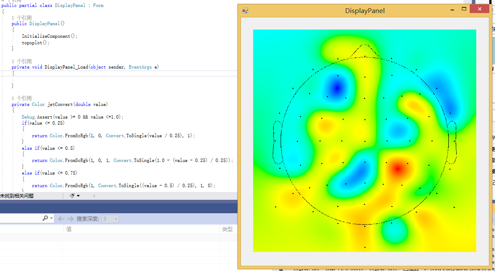

> Past Epic

  
2021-07-06 - 2021-07-12

  ## Studying Progress
  * Reading "Analyzing Neural Time Series Data"[Chapter 1 - Chapter 4]

      * Notes (part, [Chapter3-link](./notes/chapter3.pdf)）
      * `Matlab` Programming Exercises 4.7 

  * Studying C# With Microsoft
      
      * [Take your first steps with C#](https://docs.microsoft.com/en-us/learn/paths/csharp-first-steps/)
      * [Work with data in C#](https://docs.microsoft.com/en-us/learn/paths/csharp-data/)

  ## Issues Encountered
  - [] What does the phase `foward model` means ?

    * introduced in future chapter.

  - [x] Are ERP activities specific to one frequency band ?
  - [x] What does the sentence `Exploratory analyses might lack the sensitivity to detect subtle features of the results` means ?
  - [x] What does the phase `sweat potential` means ?

  ## Next Plan

  - [x] Read "Analyzing Neural Time Series Data"[Chapter 5 - Chapter 7]
  - [x] Finish C# Studying Resources in Microsoft learning website.
        

  
2021-07-13 - 2021-07-19

  ## Studying Progress
  * Reading "Analyzing Neural Time Series Data"[Chapter 5 - Chapter 7]

      * Notes (part, [Chapter5-link](./notes/chapter5.pdf), [Chapter7-link](./notes/chapter7.pdf)）

  * Studying C# With Microsoft
      
      * [Build .NET applications with C#](https://docs.microsoft.com/en-us/learn/paths/build-dotnet-applications-csharp/)
      * [Add logic to your applications with C#](https://docs.microsoft.com/en-us/learn/paths/csharp-logic/)

  ## Issues Encountered
  - [x] What does the word `taper` means ?

  ## Next Epic Plan

  - [x] Read "Analyzing Neural Time Series Data"[Chapter 8 - Chapter 10].
  - [x] Follow Microsoft resource and build a mobile app.
  - [ ] Try to read one thesis from lab and log questions. `In Progress`

  
2021-07-20 - 2021-07-26

  ## Studying Progress
  * Reading "Analyzing Neural Time Series Data"[Chapter 8 - Chapter 10]

      * Notes (part, [Chapter8-link](./notes/chapter8.pdf), [Chapter9-link](./notes/chapter9.pdf)）
      * `Matlab` Programming Exercises Chapter 9 & 10

  * Studying C# With Microsoft
      
      * [Build mobile apps with Xamarin.Forms](https://docs.microsoft.com/en-us/learn/paths/build-mobile-apps-with-xamarin-forms/)

  ## Issues Encountered
  *None*

  ## Next Epic Plan

  - [x] Read "Analyzing Neural Time Series Data" [Chapter 11 - Chapter 13]. 
  - [x] Try To Implement Basic `topoplot` Function From EEGLAB In C#.

  
2021-07-27 - 2021-08-01

  ## Studying Progress
  * Reading "Analyzing Neural Time Series Data"[Chapter 11 - Chapter 12]

      * Notes (part, [Chapter12-link](./notes/chapter12.pdf)）
      * `Matlab` Programming Exercises Chapter 11 & 12

  * Try to Implemented topoplot in C#
  
      </img>
      * 2D interpolation method from alglib library
      * values are scaled into 0 to 1, and are sent into jet color convertor to generate the value-related color(from blue to red). 
      
  ## Issues Encountered
  Struggling with `Signal & System` Background...

  ## Next Epic Plan
  * Focus on quality, not quantity.
  - [x] Finish "Analyzing Neural Time Series Data" [Chapter 13]. 
    - [x] Understand Signal Processing Knowledge Behind.
  - [x] Read "Analyzing Neural Time Series Data" [Chapter 14].
  - [ ] Read EEG-related Open Source Code.

  
2021-08-02 - 2021-08-08

  ## Studying Progress
  
  * Reading "Analyzing Neural Time Series Data" [Chapter 13 - Chapter 14]

      * Notes (part, [Chapter13-link](./notes/chapter13.pdf)）
      * `Matlab` Programming Exercises Chapter 13

  * Be Familiar With BIDS
    
      * [BIDS Tutorial Series: Introductory Walkthrough](https://reproducibility.stanford.edu/bids-tutorial-series-part-1a/)
      * [BIDS Tutorial Series: Automate the Introductory Walkthrough](https://reproducibility.stanford.edu/bids-tutorial-series-part-1b/)
        
    * Getting Start Lab Streaming Layer [[link]](https://github.com/sccn/liblsl)

  ## Issues Encountered
  Struggling with `Signal & System` Background...

  ## Next Epic Plan
  - [x] Finish "Analyzing Neural Time Series Data" [Chapter 15 & 16]. 
  - [x] Revise Chapter 13 & 14.
  - [x] Read "Analyzing Neural Time Series Data" [Chapter 14].
  - [ ] Read EEG-related Open Source Code.

  
2021-08-09 - 2021-08-15

  ## Studying Progress
  * Revise "Analyzing Neural Time Series Data" [Chapter 13 & 14].
    * `Matlab` Programming Exercises Chapter 14.
  * Reading "Analyzing Neural Time Series Data" [Chapter 15 - Chapter 18]
    * Finish Chapter 15-17, Chapter 18 is in progress.
    * `Matlab` Programming Exercises Chapter 15. [99% consistent with the solution]
  * Continue Be Familiar With Lab Streaming Layer [[link]](https://github.com/sccn/liblsl)

  ## Issues Encountered
  Struggling with `Signal & System` Background...

  Struggling with Lab in ANTSD

  ## Next Epic Plan
  - [x] Finish "Analyzing Neural Time Series Data" [Chapter 18 & Lab From Chapter 16/18]. 
  - [ ] Learn the Course Video From Mike.
  - [x] Read Paper `Deep learning-based electroencephalography analysis: a systematic review`

  
2021-08-16 - 2021-08-23

  ## Studying Progress
  * Reading "Analyzing Neural Time Series Data" [Chapter 18]
    * `Matlab` Programming Exercises Chapter 16 & 18. [99% consistent with the solution]
    * Ask Mike for solution parameter setting [[forum link]](https://discuss.sincxpress.com/t/reproducing-exercises-for-analyzing-neural-time-series-data/272/23)
  * Read review: `Deep learning-based electroencephalography analysis: a systematic review`
  * Implement Figure 16.1 with python in chapter 16 [[jupyter-notebook]](./FigureImplementation/python/chapter16.ipynb)
  * Fix compile and runtime coredump error in mutitaper code (both version 2004.05.27 and 2006.09.18), and run successfully in ubuntu 18.04 with gcc 7.5.0, [[code, fixed code at feature/ branches]](https://github.com/byebaibai/MTM)

  ## Issues Encountered
  Struggling with `Signal & System` Background...

  Struggling with Lab in ANTSD

  ## Next Epic Plan
  - [x] Finish "Analyzing Neural Time Series Data" [Chapter 19 & 20, & Lab From Chapter 19/20]. 
  - [ ] Implemented all figures from chapter 16 and 19 `Finished chapter 16`
  - [ ] Learn the Course Video From Mike.
  - [x] Read Paper and Source Code From `Multiple-taper spectral analysis A stand-alone C-subroutine`
  - [x] Read Paper `A Review of Multitaper Spectral Analysis`

> This Epic
  
  **2021-08-24 - 2021-08-30**
  ## Studying Progress
  * Reading "Analyzing Neural Time Series Data" [Chapter 19 - 20]
    * `Matlab` Programming Exercises Chapter 19 & 20. [99% consistent with the solution in chapter 19]
  * Read review and source code: `Multiple-taper spectral analysis A stand-alone C-subroutine`
  * Read review: `A Review of Multitaper Spectral Analysis` 
  * Implement All Figures with python in chapter 16 [[jupyter-notebook]](./FigureImplementation/python/chapter16.ipynb)

  ## Issues Encountered
  Struggling with `Signal & System` Background and Mathmatics...

  Struggling with Lab in ANTSD

  ## Next Epic Plan
  - [ ] Finish "Analyzing Neural Time Series Data" [Chapter 21, and Fix Bugs in Lab 20]. 
  - [ ] Implemented all figures from chapter 20
  - [ ] Learn the Course Video From Mike.
  - [ ] Getting ready to start school.